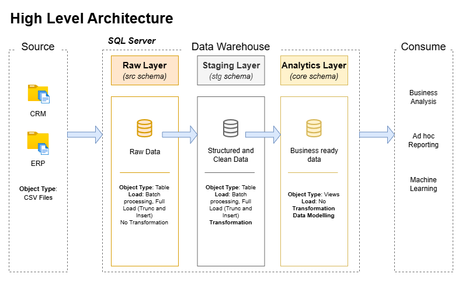
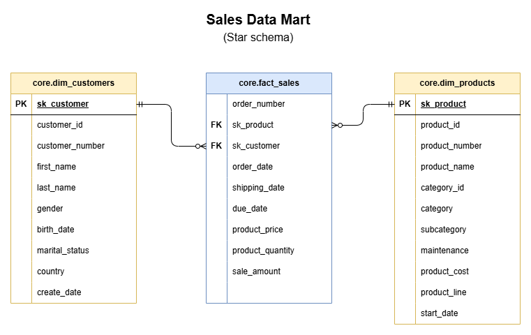

# 📊 Sales Data Mart: End-to-End SQL Server Data Warehouse

This repository contains the code and architecture for a professional-grade Data Warehouse built on **SQL Server**. The project integrates fragmented, real-world data from disparate **CRM** and **ERP** systems, cleansing and transforming it into a high-performance **Star Schema** designed for Business Intelligence and analytical reporting.

---

## 🏗️ Architecture & Data Flow

The data pipeline follows a robust three-tier architecture to ensure data lineage, quality, and query performance:
1. **Raw Layer (`src`)**: Direct ingestion of source data with zero transformations.
2. **Staging Layer (`stg`)**: Application of business logic, deduplication, data type casting, and referential integrity checks.
3. **Analytics Layer (`core`)**: The final presentation layer modeled as a Star Schema with Surrogate Keys (SK).



*Figure 1: End-to-end data pipeline from raw flat files to the consumption layer.*

### The Star Schema (Analytics Layer)
The Core layer exposes a clean dimensional model consisting of customer and product dimensions tied to a central sales fact table.



*Figure 2: Final dimensional model optimized for BI tools like Power BI.*

---

## 📁 Repository Structure

```text
sql-server-data-warehouse/
├── data/                        # Local raw data directory
│   ├── source_crm/              # Customer, Product, and Sales CSV extracts
│   └── source_erp/              # Demographic, Category, and Location CSV extracts
├── docs/                        # Technical documentation
│   ├── images/                  # Architecture and schema diagrams
│   ├── DATA_CATALOGUE.md        # Table granularity, metadata, and column definitions
│   └── NAMING_CONVENTIONS.md    # Standardized rules for schemas, tables, and keys
├── scripts/                     # SQL codebase
│   ├── ddl/                     # Data Definition Language (Schema generation)
│   │   ├── 01_setup_database.sql       # Initializes database and schemas
│   │   ├── 02_create_source_tables.sql # Defines Raw (`src`) layer tables
│   │   ├── 03_create_staging_tables.sql# Defines Staging (`stg`) layer tables
│   │   └── 04_create_core_views.sql    # Defines Analytics (`core`) Star Schema views
│   ├── etl/                     # Extract, Transform, Load processes
│   │   ├── usp_load_raw.sql            # Stored proc to BULK INSERT raw files
│   │   ├── 01_bulk_load_src.sql        # Execution script for raw ingestion
│   │   ├── usp_load_stg.sql            # Unified stored proc for data cleansing
│   │   └── 02_load_stg.sql             # Execution script for staging transformations
│   └── quality_checks/          # Data validation and integrity testing
│       ├── val_stg_layer.sql           # Scans staging for nulls, duplicates, & math errors
│       └── val_core_layer.sql          # Validates referential integrity & surrogate keys
├── LICENSE                      # MIT License
└── README.md                    # Project overview (this file)
```
---

## 🚀 Setup & Execution

To recreate this Data Warehouse on your local SQL Server instance, follow these steps sequentially:

> **⚠️ IMPORTANT: Local File Path Configuration**
> The `scripts/etl/usp_load_raw.sql` file contains hardcoded absolute paths pointing to the local source files on my machine. **Before running the ETL pipeline, you must open `usp_load_raw.sql` and update the `@base_path` or individual `BULK INSERT` paths to match the exact location of the `/data` folder on your system.**

1. **Deploy Schemas:** Execute scripts `01` through `04` in the `scripts/ddl/` folder to build the database skeleton.
2. **Ingest Raw Data:** Execute `scripts/etl/01_bulk_load_src.sql` (after updating your file paths) to load the CSVs into the `src` layer.
3. **Run Transformations:** Execute `scripts/etl/02_load_stg.sql` to trigger the cleansing and integration procedures.
4. **Validate Pipeline:** Run the scripts in `scripts/quality_checks/` to verify data consistency and referential integrity.

---

## 👨‍💻 About Me

Aspiring Data Analyst focused on helping startups understand:

- Revenue trends
- Customer behavior
- Marketing performance

Skilled in:
- SQL for data analysis
- Power BI for dashboarding
- Excel for business analysis
- Python for data analysis


* **LinkedIn:** [View Profile](https://www.linkedin.com/in/asif-khan-data/)
* **Email:** [Send Email](mailto:khan.asif@outlook.in)

---

* **Optimization Note:** AI tooling was utilized during the development of this project to strictly enforce enterprise naming conventions, optimize T-SQL query readability, and structure technical documentation.
* **License:** This project is licensed under the MIT License - see the `LICENSE` file for details.
